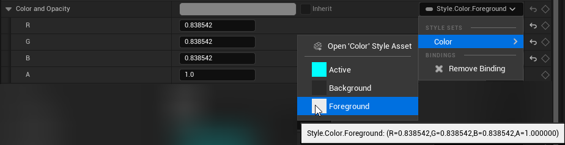
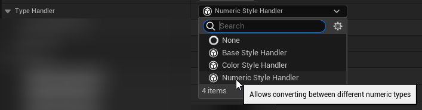

# MDStyleSets

A plugin for promoting consistent UI styling by defining and binding to Style Assets for Unreal Engine 5.4+

**REQUIRED ENGINE CHANGE**:
The property binding extension API was missing information so [this pull request](https://github.com/EpicGames/UnrealEngine/pull/12292) is required for this plugin to work.

## Creating Style Assets

Style Assets are a type of Data Asset. Create a new Data Asset and select `MDStyle Set` to create a new Style Asset.


Open up the new asset then the first thing to do is to select the `Style Type` that your style entries will be. This can be any single blueprint-compatible type (Arrays/Maps/Sets are not supported). For this example, I'm creating a Text style set.

You can set a `Display Name` for your style, this will be displayed throughout the editor when selecting style values. This is optional, the style asset's name will be used if this is left empty.

The `Style Set Tag` is used as the root tag for all the style set's entries, it's recommended to use a unique tag per Style Asset to keep things organized.

The `Type Handler` is [explained below](#style-type-handlers).

The `Fallback Value` will be returned when `GetStyleValue` is called with a tag that is not in the list of style entries.

The `Style Entries` are the actual style values for the style asset. They are mapped to gameplay tags, which is how they are referenced by anything wanting to get a style value.

You may choose to click the `Sort Entries` button at the top to sort the Style Entries alphabetically by their tag to keep everything organized.


## Binding to Styles

### UMG Designer

Widgets can bind styles to their properties. This is the most efficient method to set a style value, as the style value is copied into the widget's property when the blueprint is compiled. Not to be confused with the old-style property bindings that are infamous with poor performance, this just uses the same UI to set the value.



### Blueprint

Style nodes are auto-generated based on the existing [Style Assets](#creating-style-assets), find them by searching `Style Set` in the blueprint action menu.


### C++

Working with styles in C++ is not as straight forward because the style value type is not known at compile time.

`bool UMDStyleSet::TrySetPropertyValue(const FGameplayTag& ValueTag, const FProperty* DestProp, void* DestPtr)` can be used to set the value of a specific property in C++.

`TTuple<FPropertyBagPropertyDesc, const uint8*> UMDStyleSet::GetStyleValue(const FGameplayTag& ValueTag)` can be used to grab the value of a specific tag in a style asset.

## Style Type Handlers

Style type handlers are extensions of style sets that add advanced functionality to style assets. The plugin comes with `Numeric` and `Color` type handlers that handle converting between the various numeric and color types, respectively. The `Color` type handler also creates a preview widget for displaying the selected color values.

Type handlers can be created as either Blueprint or C++ classes.



### Converting Compatible Types

**Note:** this is only possible with C++ type handlers.

You're limited to a single value type within a Style asset, but some types are indirectly compatible with others. For example, a `Linear Color` style could be bound to a `Slate Color` or `Color` property.

To support converting style values to other types, there are 2 functions to override:
```cpp
void GetConvertibleTypes(TArray<FPropertyBagPropertyDesc>& OutConvertibleTypes) const;
bool TrySetValue(const TTuple<FPropertyBagPropertyDesc, const uint8*>& Value, const FPropertyBagPropertyDesc& DestDesc, void* DestPtr) const
```

Implement `GetConvertibleTypes` to specify the types that can be converted with the handler. This will get checked by the binding UI in the editor when populating the list of styles a property can bind to.
```cpp
void UMDStyleSetTypeHandler_Color::GetConvertibleTypes(TArray<FPropertyBagPropertyDesc>& OutConvertibleTypes) const
{
	Super::GetConvertibleTypes(OutConvertibleTypes);

	OutConvertibleTypes.Add(FPropertyBagPropertyDesc(FMDStyleValue::ValuePropertyName, EPropertyBagPropertyType::Struct, TBaseStructure<FLinearColor>::Get()));
	OutConvertibleTypes.Add(FPropertyBagPropertyDesc(FMDStyleValue::ValuePropertyName, EPropertyBagPropertyType::Struct, TBaseStructure<FColor>::Get()));
	OutConvertibleTypes.Add(FPropertyBagPropertyDesc(FMDStyleValue::ValuePropertyName, EPropertyBagPropertyType::Struct, TBaseStructure<FSlateColor>::Get()));
}
```

Then, implement `TrySetValue` to convert the `Value` to the type of `DestDesc` in `DestPtr` (see `UMDStyleSetTypeHandler_Color::TrySetValue` for an example).

Here, float styles are valid assignments for an integer property, thanks to the Numeric Style Handler.


### Previewing Style Values

When selecting a style in the editor, it's useful to be able to see a preview of the style value that you're selecting. The style handler allows you to specify a widget that will be created to preview style values.


